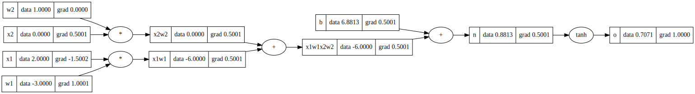
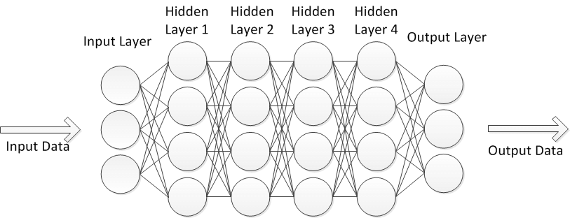

# nanograd

<div align="center">
  
</div>

A minimal implementation of backpropagation (reverse-mode autodiff) over a dynamically built computational graph. Perfect for understanding how modern frameworks like PyTorch work under the hood.

## Installation

```bash
git clone https://github.com/AbdulmalikDS/nanograd.git
cd nanograd
```

## Quick Start

```python
from engine import Value

# Create values
a = Value(2.0, label='a')
b = Value(3.0, label='b')

# Do math
c = a * b + 5
c.label = 'c'
c.backward()

# Check gradients
print(a.grad)  # 3.0
print(b.grad)  # 2.0
```
### Visualize the Computation Graph

Nanograd builds a computation graph and can visualize how gradients flow backward:

```python
from utils.visualize import draw_dot

# Build a simple neuron
x1 = Value(2.0, label='x1')
x2 = Value(0.0, label='x2')
w1 = Value(-3.0, label='w1')
w2 = Value(1.0, label='w2')
b = Value(6.8813, label='b')

# Forward pass: x1*w1 + x2*w2 + b
x1w1 = x1*w1; x1w1.label = 'x1*w1'
x2w2 = x2*w2; x2w2.label = 'x2*w2'
n = x1w1 + x2w2 + b; n.label = 'n'
o = n.tanh(); o.label = 'o'

# Backward pass
o.backward()

# Visualize
draw_dot(o)
```

<div align="center">
  
</div>

*The graph shows both forward pass (data values) and backward pass (gradients) for each operation.*

## Neural Network

```python
from nn import MLP

# Create network: 3 inputs → 4 neurons → 4 hidden → 1 output
model = MLP(3, [4, 4, 1])

# Forward pass
x = [2.0, 3.0, -1.0]
output = model(x)

# Compute loss and backprop
loss = (output - 1.0)**2
loss.backward()
```

<div align="center">
  
</div>

*A multi-layer perceptron with input layer, hidden layers, and output layer.*

## Comparison with PyTorch

<div style="display: flex; gap: 20px;">

<div style="flex: 1;">

### nanograd
```python
from engine import Value

x1 = Value(2.0)
x2 = Value(0.0)
w1 = Value(-3.0)
w2 = Value(1.0)
b = Value(6.8813)

n = x1*w1 + x2*w2 + b
o = n.tanh()
o.backward()

print(o.data)  # 0.7071
print(x2.grad) # 0.5001
print(w2.grad) # 0.0
print(x1.grad) # -1.5002
print(w1.grad) # 1.0001
```

</div>

<div style="flex: 1;">

### PyTorch
```python
import torch

x1 = torch.Tensor([2.0]).double()
x2 = torch.Tensor([0.0]).double()
w1 = torch.Tensor([-3.0]).double()
w2 = torch.Tensor([1.0]).double()
b = torch.Tensor([6.8813]).double()
for t in [x1, x2, w1, w2, b]:
    t.requires_grad = True

n = x1*w1 + x2*w2 + b
o = torch.tanh(n)
o.backward()

print(o.item())       # 0.7071
print(x2.grad.item()) # 0.5001
print(w2.grad.item()) # 0.0
print(x1.grad.item()) # -1.5002
print(w1.grad.item()) # 1.0001
```

</div>

</div>

See [`examples/pytorch_comparison.py`](examples/pytorch_comparison.py)

## What's Inside

- `engine.py` - Core `Value` class with autograd
- `nn.py` - Neural network components (Neuron, Layer, MLP)
- `loss.py` - Loss functions (MSE, MAE, Binary Cross-Entropy)
- `optim.py` - Optimizers (SGD, Adam, RMSprop)
- `utils/` - Visualization utilities

## Examples

Check the `examples/` folder:
- `basic_operations.py` - Simple math operations
- `train_mlp.py` - Training a neural network
- `neuron.py` - Visualization demo
- `optimizers.py` - Compare different optimizers
- `loss.py` - Loss functions examples

## Acknowledgments

Inspired by [Andrej Karpathy's micrograd](https://github.com/karpathy/micrograd). 

## License

MIT
